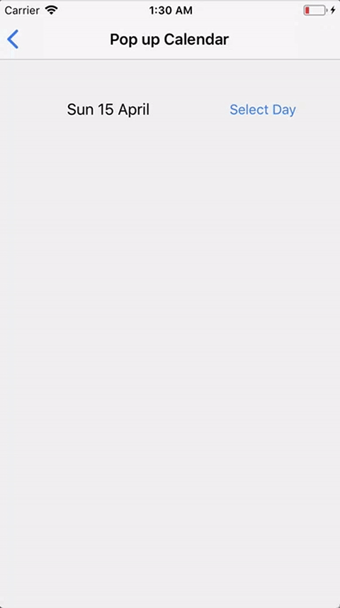
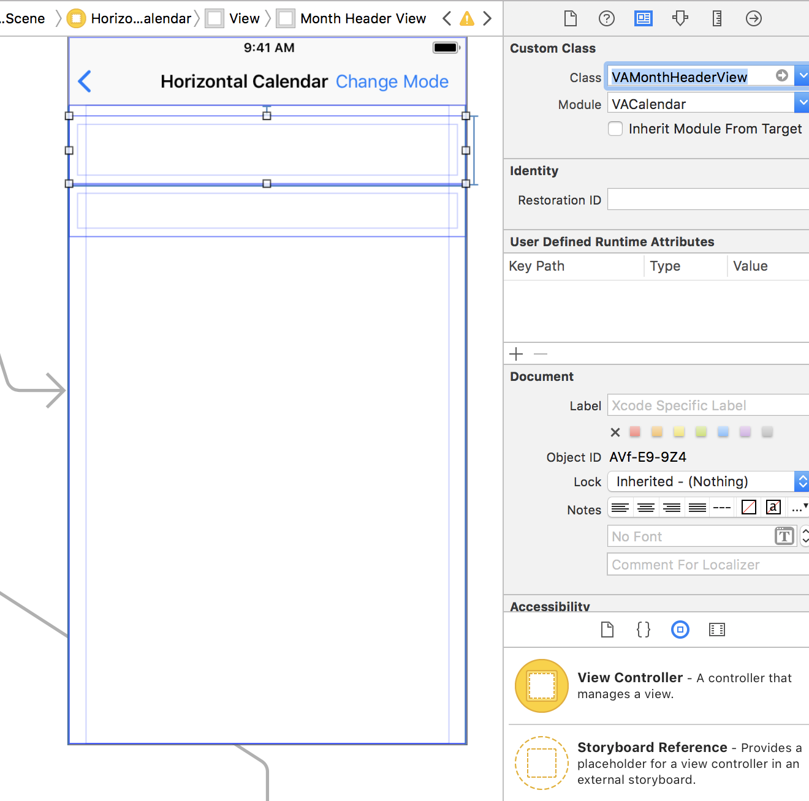
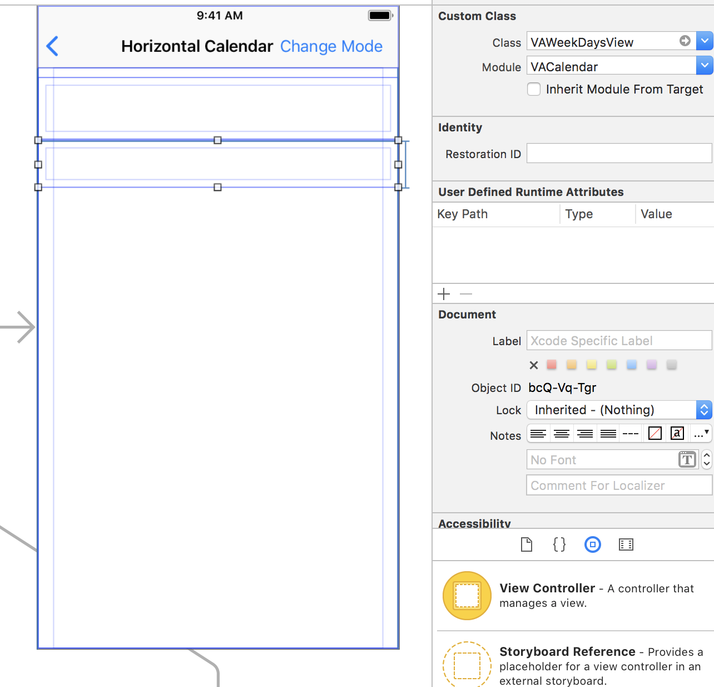

<p align="center"></p>

# Screenshot
<p>
   
</p>

## About

The calendar with support for:

* Horizontal and vertical swipe directions
* Showing days out
* Single and multi days selection
* First weekday sunday or monday
* Supplementary views

## Usage
Check `Example Folder` to see implementation of all possible variants of calendar.

In order to create calendar with horizontal scroll direction: 

1. Create storyboard with 2 UIViews
2. Make the first one subclass of `VAMonthHeaderView`, it will represent the name of the month and the control buttons to switch between months

<p align="center"></p>

3. Make the second view subclass of `VAWeekDaysView`, this view will display weekdays names

<p align="center"></p>

4. I recommend that you specify your own calendar with the settings `firstWeekday` and` timeZone` to correctly display dates

```swift
let defaultCalendar: Calendar = {
    var calendar = Calendar.current
    calendar.firstWeekday = 1
    calendar.timeZone = TimeZone(secondsFromGMT: 0)!
    return calendar
}()
```

5. Configure appearance of `VAMonthHeaderView` and `VAWeekDaysView`

```swift
    @IBOutlet weak var monthHeaderView: VAMonthHeaderView! {
        didSet {
            let appereance = VAMonthHeaderViewAppearance(
                previousButtonImage: #imageLiteral(resourceName: "previous"),
                nextButtonImage: #imageLiteral(resourceName: "next"),
                dateFormat: "LLLL"
            )
            monthHeaderView.delegate = self
            monthHeaderView.appearance = appereance
        }
    }
    
    @IBOutlet weak var weekDaysView: VAWeekDaysView! {
        didSet {
            let appereance = VAWeekDaysViewAppearance(symbolsType: .veryShort, calendar: defaultCalendar)
            weekDaysView.appearance = appereance
        }
    }
```

## Example project

Take a look at the example playground over [here](Example/)

## Requirements

* Swift 4.0
* Xcode 9
* iOS 10.0+

## Installation

#### [CocoaPods](http://cocoapods.org)

````ruby
use_frameworks!

pod 'VACalendar'

````

## License

`VACalendar` is released under an MIT License. See `LICENSE` for details.
