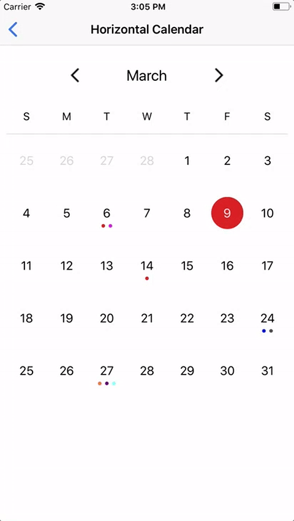

# VACalendar

<p>
  
</p>

## About

The calendar with support for:

* Horizontal and vertical swipe directions
* Showing days out
* Single and multi days selection
* First weekday sunday or monday
* Supplementary views

## Documentation

Will be added soon

## Requirements

* Swift 4.0
* Xcode 9
* iOS 10.0+

## Installation

#### [CocoaPods](http://cocoapods.org)

````ruby
use_frameworks!

pod 'VACalendar'

````

## License

`VACalendar` is released under an MIT License. See `LICENSE` for details.
